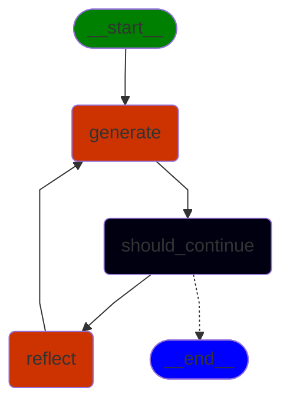

```mermaid
%%{init: {'flowchart': {'curve': 'linear'}}}%%
graph TD;
	__start__([<p>__start__</p>]):::first
	generate(generate)
    should_continue(should_continue):::should_continue
	reflect(reflect)
	__end__([<p>__end__</p>]):::last
	__start__ --> generate;
    should_continue --> reflect;
	reflect --> generate;
    generate --> should_continue;
	should_continue -.-> __end__;
	classDef default fill:#CC3300,line-height:1.2
    classDef should_continue fill:#000011

	classDef first fill:#008000
	classDef last fill:#0000FF
```